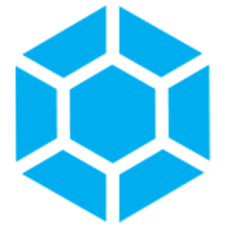

<h1 align="center">
  <br>
  Gemstone Lights for Home Assistant
</h1>

<p align="center">
  <a href="https://hacs.xyz"></a>
  <a href="https://github.com/sslivins/hass-gemstone/releases/latest"></a>
  <a href="https://github.com/sslivins/hass-gemstone/actions/workflows/validate.yml"></a>
  <a href="https://github.com/sslivins/hass-gemstone/actions/workflows/unit_tests.yml"></a>
  <a href="LICENSE"></a>
</p>

<p align="center">
  Control your <a href="https://gemstonelights.com">Gemstone Lights</a> permanent
  Christmas-light controllers from Home Assistant — power, brightness,
  and pattern selection from a Home Assistant account, no extra hub.
</p>

---

## Features

- 🔌 **One-click install** via HACS (see button below).
- 💡 **`light.<controller>`** — on/off plus brightness 0–255. Brightness
  is applied to the active pattern; the colour palette is preserved.
- 🎨 **`select.<controller>_pattern`** — pick any pattern from your
  saved folders.
- 🏠 **Multi-home / multi-controller** — every controller across every
  homegroup on your account is discovered automatically.
- ⚡ **Snappy UI** — every command is immediately followed by a re-poll
  so the entity state updates within a second.

## Quick install

[](https://my.home-assistant.io/redirect/hacs_repository/?owner=sslivins&repository=hass-gemstone&category=Integration)

Click the button above on a device that has access to your Home
Assistant. It takes you straight to the **Add custom repository**
dialog in HACS with everything pre-filled.

After it installs:

1. **Restart Home Assistant.**
2. Go to **Settings → Devices & Services → Add Integration**, search
   for **Gemstone Lights**.
3. Sign in with the same email + password you use in the Gemstone
   mobile app.

## Requirements

- Home Assistant **2026.5** or newer
- [HACS](https://hacs.xyz) installed
- A working Gemstone Lights mobile-app account
- At least one controller already paired with the app

## Manual install (without HACS)

If you don't run HACS:

1. Copy the entire `custom_components/gemstone/` directory into your
   Home Assistant `config/custom_components/` directory.
2. Restart Home Assistant.
3. Add the integration from **Settings → Devices & Services**.

## How it works

The integration logs in to Gemstone's AWS Cognito user pool, walks
your homegroups to discover every controller, then polls each one
every 30 seconds. It's a thin wrapper around
[`pygemstone`](https://github.com/sslivins/pygemstone)
([PyPI](https://pypi.org/project/pygemstone/)), which does the
heavy lifting.

The Gemstone backend has an AppSync GraphQL endpoint for push
updates, but the official iOS app never opens it — so we poll for the
same reason it does.

## Roadmap / not yet implemented

- **RGB colour control.** Colour is determined by the active pattern.
  Build the colour palettes you like in the Gemstone app, then pick
  them from the `select` entity.
- **Animation / speed / direction tweaks.** Patterns are played as
  authored.
- **Timers, autopilot events, downloadable pattern library.** Already
  exposed by `pygemstone`, just not surfaced as HA entities yet.
- **Push updates** via the AppSync subscription.

## Credentials

Your Gemstone password is stored only in the Home Assistant config
entry (encrypted at rest like every other HA credential) and is never
written to logs by this integration.

## Development

```bash
python -m venv .venv
. .venv/Scripts/Activate.ps1     # Windows PowerShell
# or:  source .venv/bin/activate # macOS / Linux
pip install -e ".[tests]"

ruff check custom_components/gemstone tests
mypy custom_components/gemstone
pytest
```

> **Note:** running the full pytest suite locally on Windows fails
> because `pytest-homeassistant-custom-component` ultimately imports
> `fcntl`, which is Unix-only. Tests run cleanly on Linux CI.

## Contributing

Bug reports and PRs welcome on the
[issue tracker](https://github.com/sslivins/hass-gemstone/issues).

## License

[MIT](LICENSE) © [sslivins](https://github.com/sslivins)
